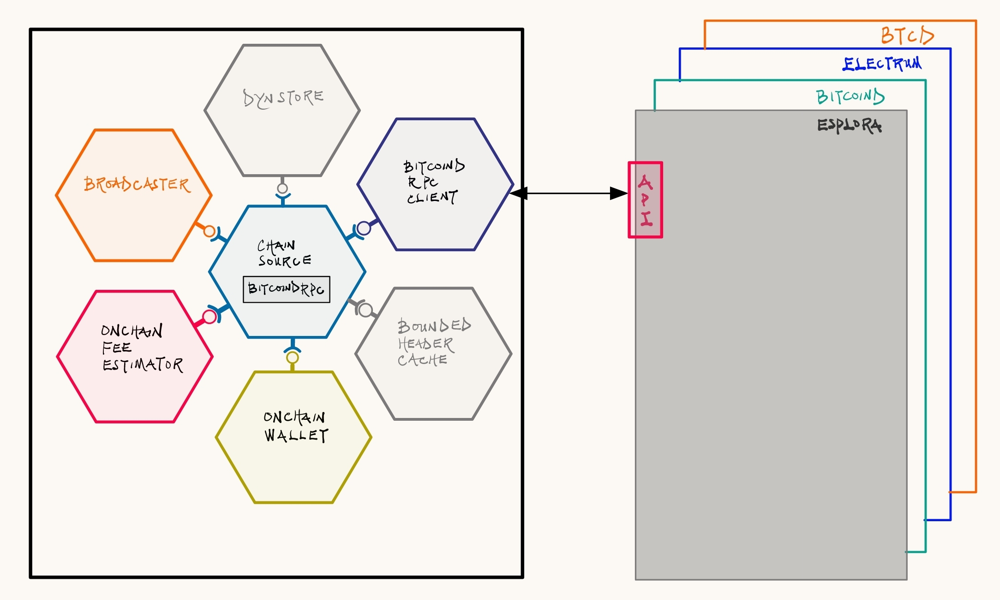

# Chain Sourcing Lightning Nodes

## Introduction

Channels on the Lightning Network (LN) are anchored on the base layer. They are turbo-charged transactions that represent high-speed transaction conduits whose lifecycle is managed by LN nodes. The LN nodes have two primary responsibilities:

* The off-chain management of transaction in the channel.
* The vigilant monitoring of onchain transactions for any effects that impact channel status.

To effectively do this, the LN nodes rely on a chain data sourcer that connects to block sources, like bitcoind, esplora and/or electrum servers, etc and provides notifications about onchain transaction state. This article explores the properties of such a chain data sourcer in two distinct operational modes/orientation:

* Block
* Transaction

Before proceeding, we take a short detour to establish the particular responsibilities of LN nodes with respect to the channels they manage:

Firstly, for every distinct channel a LN node (plans to) operate with a peer/counterparty (another LN node), the node must monitor all transactions related to the channel. This is crucial because each node must determine the precise moment to consider a channel open and ready for normal operations, or alternatively, breached, unresponsive, and/or closing, and requiring onchain fund claims.

**Figure 1** below depicts channels between two nodes, showing their anchorage to a transaction in a block on the base layer.

<figure><figcaption>
<strong>Figure 1</strong>: Depiction of LN channels as conduit of high-speed transactions anchored on the base onchain layer. A channel monitor has to keep track of the onchain events that impact the channel's transactions of interest.
</figcaption></figure>

Secondly, nodes must monitor the current/instantaneous onchain fee rates for their wallets (on-/off-chain) to calculate the right transaction fees for funding channels or for claims. Additionally, nodes that offer liquidity services, i.e., Liquidity Service Providers (LSPs), require onchain monitoring for special channels, such as Just-In-Time (JIT) channels they maintain with other nodes.

These requirements uniquely identify a channel manager (to handle offchain logic and state management), a chain monitor and its collection of channel monitors, on-/off-chain wallets, and liquidity managers as node objects/structures that observe the chain data sourcer, expecting (listening for) notifications on transactions of interest.

As previously stated, the high-level logic for chain data sourcing is two-fold. The first regularly polls the blockchain source for chain data. The second notifies/updates interested parties (wallets, chain monitor, channel manager, channel monitors) of any important updates.

## Block-oriented Chain Data Sourcing

Block-oriented chain data sourcing involves directly interacting with a full bitcoin node to obtain complete chain data. This method is suitable for nodes with ample computational power and storage, as it requires processing and storing large volumes of data. The method provides the highest level of trust, because the LN node validates all data itself.&#x20;

The nodes provide a collection of channel monitors (one per channel), on-/off-chain wallets, and liquidity managers that can `listen` for block (dis)connection events of note. These listeners require constant updates to maintain accurate information about the blockchain. So, when blocks are mined, the chain data sourcer polls the blockchain for updates, and then updates/notifies the listeners interested in the block events.&#x20;

A typical use case for such a sourcer is the continuous synchronization of listeners to the most-Proof-of-Work (POW) chain tip. This typically involves:

1. Syncing wallets so they are aware of relevant transactions.
2. Updating the fee rate estimates so that transactions/claims can be broadcast and bumped with the right fees.
3. Broadcasting transactions.

<figure><figcaption>
<strong>Figure 2</strong>: Interaction between a block-oriented chain data sourcer, a block source, and block event listeners.
</figcaption></figure>

### Implementation Aside: Block-syncing with LDK

LDK, in its `lightning-block-sync` crate, provides a helpful client to keep listeners in-sync with the blockchain. In-sync here meaning that the listeners all have the same view of the blockchain.

Having the same view is important because at any time $$T_1$$, the state of the blockchain will change from when it was last viewed. Blocks are connected and disconnected as transactions are mined. The best chain tip with the most-POW chain changes over time, thus, the chain data sourcer must synchronize all listeners to the best chain tip as it changes.

<figure><figcaption>
<strong>Figure 3</strong>: Listeners' view of the blockchain's best tip changes as blocks are connected and disconnected during chain re-organization over time.
</figcaption></figure>

**Figure 3** depicts the changing blockchain as viewed at different timestamps $$T_i$$ by the sourcer, who in turn, notifies the listeners of this view. At $$T_1$$, the best tip $$block_{n + 6}$$ is on $$chain_3$$. At some other time $$T_2$$, the best tip is at $$block_{n + 6}$$ on $$chain_2$$.

<figure><figcaption>
<strong>Figure 4</strong>: LDK's Simple Payment Verification (SPV) Client.
</figcaption></figure>

To achieve this synchronization, LDK provides a lightweight Simple Payment Verification (SPV) client - [SpvClient](https://github.com/lightningdevkit/rust-lightning/blob/8b3f6cca2f3f33cd6f5bb68ef2db7caa593278c7/lightning-block-sync/src/lib.rs#L182) (**Figure 4** above) that polls a trusted block source for block and header data with its [ChainPoller](https://github.com/lightningdevkit/rust-lightning/blob/8b3f6cca2f3f33cd6f5bb68ef2db7caa593278c7/lightning-block-sync/src/poll.rs#L200), via a [BlockSource](https://github.com/lightningdevkit/rust-lightning/blob/8b3f6cca2f3f33cd6f5bb68ef2db7caa593278c7/lightning-block-sync/src/lib.rs#L59) client. Afterwards, it updates the provided [Listen](https://github.com/lightningdevkit/rust-lightning/blob/8b3f6cca2f3f33cd6f5bb68ef2db7caa593278c7/lightning/src/chain/mod.rs#L80)ers with its [ChainNotifier](https://github.com/lightningdevkit/rust-lightning/blob/8b3f6cca2f3f33cd6f5bb68ef2db7caa593278c7/lightning-block-sync/src/lib.rs#L300). This update is a little nuanced because:

1. The blockchain is a continuously updating ledger.
2. The listeners' view of the chain will change in-between poll requests as 1 happens.
3. Listeners need to be informed of newly (dis)connected blocks, and if there is chain re-organization, the observed chain difference.

<figure><figcaption>
<strong>Figure 5</strong>: Computing the chain difference when there is a re-organization with blocks connected and disconnected.
</figcaption></figure>

To handle blockchain reorganizations, the notifier must identify what changed between updates. The notifier identifies a shared/common ancestor block (**Figure 5C**) that exists in both:

* The previously notified chain state ($$chain_2$$ in **Figure 5A**)
* The new chain ($$chain_1$$ in **Figure 5B**).&#x20;

Having identified such an ancestor, which represents the last point of agreement between both chains, it utilizes the ancestor as a foundation for calculating exactly what blocks need (dis)connection. The notifier then:

* Walks back the blocks in $$chain_2$$, disconnecting all blocks from tip until it reaches the ancestor.
* Walks up the blocks in $$chain_1$$, connecting all until from the ancestor until it gets to the most-POW chain tip.&#x20;

The listeners are then notified of the (dis)connected blocks.

### Implementation Aside: Chain Sourcing with LDK-Node

LDK users like [LDK Node](https://github.com/lightningdevkit/ldk-node) that are reliant on synchronization utilities from the library can then conduct an initial one-time sync to bring all listeners to the same view of the best tip on the trusted block source, and then continuously do so through the hitherto describe `SpvClient`, as the node runs. With the view updating to reflect the "instantaneous" state of the blockchain, and listeners notified of changes, the chain data sourcer can update wallets with relevant transactions, compute appropriate fee rates for transactions, and broadcast transactions as need be. **Figure 6** below depicts the primary objects in the sourcer (objects not overly important to this article are greyed out).

<figure><figcaption>
<strong>Figure 6</strong>: Component layout of LDK-Node's ChainSource that synchronizes with block-orientation. Although the SpvClient is not depicted, it is utilized internally.
</figcaption></figure>

## Transaction-oriented Chain Data Sourcing

For resource-constrained devices it is better to use a transaction-oriented Application Programming Interface (API) for chain data sourcing. The chain data sourcer should provide an interface via objects/structures can register interest in transactions and transaction outputs. In essence, subscribing to updates on the block objects when they are ready. In turn, these objects provide a confirmation interface via which the chain data sourcer can notify them when there are confirmations on monitored filtered transactions.

Block sources for these kinds of operations are typically indexed blockchain servers like [esplora](https://github.com/Blockstream/esplora) and [electrum](https://electrum-protocol.readthedocs.io/en/latest/) that permit light clients to "subscribe" to transactions and/or transaction outputs, instead of blocks, as this minimizes the computational and storage requirements the clients need.

<figure><figcaption>
<strong>Figure 7</strong>: Interaction between a transaction-oriented chain data sourcer, an indexed block source, and objects awaiting transaction event confirmation.
</figcaption></figure>

### Implementation Aside: Transaction Syncing with LDK

LDK, in its `lightning-transaction-sync` crate, provides [`EsploraSyncClient`](https://github.com/lightningdevkit/rust-lightning/blob/8b3f6cca2f3f33cd6f5bb68ef2db7caa593278c7/lightning-transaction-sync/src/esplora.rs#L45) and [`ElectrumSyncClient`](https://github.com/lightningdevkit/rust-lightning/blob/8b3f6cca2f3f33cd6f5bb68ef2db7caa593278c7/lightning-transaction-sync/src/electrum.rs#L50) that both implement a [`Filter`](https://github.com/lightningdevkit/rust-lightning/blob/8b3f6cca2f3f33cd6f5bb68ef2db7caa593278c7/lightning/src/chain/mod.rs#L330) interface. This interface allows "clients" to indicate interest in the registered transactions and outputs, which are then added to a [`FilterQueue`](https://github.com/lightningdevkit/rust-lightning/blob/8b3f6cca2f3f33cd6f5bb68ef2db7caa593278c7/lightning-transaction-sync/src/common.rs#L103). The sync clients, process these registrations and based on change in the blockchain state, i.e. the mining of a new block, determines whether: a watched transaction remains unconfirmed/confirmed, a watched output is remains unspent, or is already spent but awaiting a threshold number of confirmations. It then notifies the clients of these observations, bringing itself, and the confirmation clients into sync with the blockchain.

<figure><figcaption>
<strong>Figure 8</strong>: LDK's EsploraSyncClient.
</figcaption></figure>

The chain sourcing responsibilities remain as previously stated.

## Conclusion

In this article we explored how LN nodes can source for chain data considering orientations and resource constraints and learned how chain data sourcing is a critical architecture component in LN nodes, representing the node's ability to maintain accurate real-time blockchain state. The two primary sourcing methods offer distinct approaches to solving onchain synchronization for LN nodes, both tailored to different operational requirements and constraints.

Block-oriented sourcing with enough resources (computation and memory) can leverage direct access to bitcoin nodes, and LDK's lightweight client to maintain a continuously updating view of the blockchain. Conversely, transaction-oriented sourcing for nodes on resource-constrained devices, with their sourcer's filtration interface, can rely on indexed blockchain servers, and LDK's transaction-syncing clients to monitor only specific transactions of interest.

## References

1. [Lightning Development Kit (LDK)](https://github.com/lightningdevkit/rust-lightning)
2. [LDK Node](https://github.com/lightningdevkit/ldk-node)
