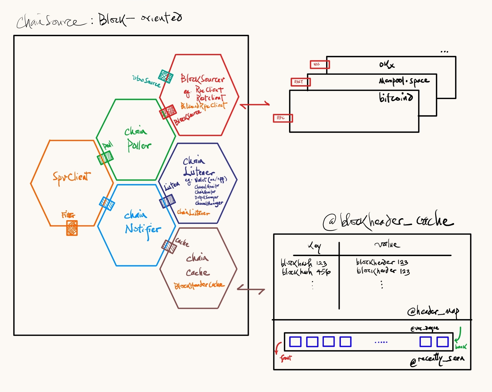

# Chain Sourcing in Lightning Nodes

[Active document (WIP)]

This article/presentation assumes (at minimum) a cursory understanding of lightning network and payment channels. It is a collection of notes taken while contributing to `ldk-node`, reviewing PRs, and reading its codebase, alongside `rust-lightning`.
#### Motivation 
Lightning Network node implementations need to monitor activities on-chain that may impact the viability/integrity of channels. The activities/events they observe usually include:
- the existence of an on-chain transaction that double-spends the funding transaction, 
- broadcast revoked commitment transactions,
- timed-out HTLC transactions, 
- closing transactions, and
- confirmation count for transactions. 

The need to source pertinent on-chain events and feed them to node LN nodes exists because an accurate and up-to-date view of the blockchain:
- makes it possible for nodes to properly validate transactions,
- improves node channel management by ensuring that nodes can quickly respond to:
	- channel closures, 
	- breached transactions broadcasts,
	- failed HTLCs and timed-out transaction,
- helps nodes to accurately calculate transaction fees,
- helps nodes with on-chain network reliability

In this article, we explore the responsibilities that node implementations have for channel management, with a particular focus on chain sourcing and how it is implemented in LDK. We start with a brief overview of the lightning network and payment channels, and then explore the separate responsibilities of channel management and chain observation, and finally look at a high-level overview LDK's implementation of chain sourcing.
### Brief overview of the Lightning Network (LN) and Payment Channels
#### The Lightning Network
The Lightning Network is a layer 2 Bitcoin Protocol made up of a network of nodes designed to scale the base bitcoin layer by handling payments off chain. It accomplishes this by allowing nodes to create channels and to route payments via themselves.

#### Payment Channels
Payment channels are bitcoin transactions turbo-charged with a smart contract to facilitate off-chain payments.
The payment channels allow nodes (peers) on the network to:
- establish a relationship based on ***pre-signed on-chain transaction*** paying to a 2-of-2 multi-signature address. 

- send offline payments by double-spending the channel funding transaction when the channel balance is split between nodes.

- this is achieve by constructing a sequence of asymmetric commitment transactions that rebalance the channel balance across peers. These transactions pay to outputs whose contracts (`scriptpubkey`s) are revocable (to punish dishonest peers) and time-bound (for honest peers).

### Node responsibilities: Channel State Management and Chain Observation

The image below captures what I see when I visualize a payment channel between two nodes A and B. Aside the off-chain management of funds within the channel, the channel is clearly anchored to an on-chain funding transaction in a block.  Node implementations have, among other duties, two linked, albeit separate responsibilities:
- Off-chain state management 
- On-chain data sourcing/monitoring

#### Channel Management
Nodes have a channel manager to handle both off- and on-chain duties. This manager delegates the responsibilities of monitoring the on-chain activities related to a channel to the channel's monitor via the chain monitor.
#### Channel Monitoring
Given that a node can have multiple channels with different nodes/peers in the network, we have seen node implementations delegate the responsibility of monitoring every channel with a single monitor per channel. This is good because each monitor has a single responsibility to dedicate attention solely to the channel it is observing.

#### Chain Monitoring
Channel monitors and other objects like wallets (on-chain and off-chain), channel manager, output sweeper, are interested in activities happening on-chain. These objects can be aggregated into a single type, i.e. objects that `listen` for monitored on-chain activities. A chain monitor, focused solely on observing the chain, can notify listeners like the channel monitors about activities of interest that have occurred on-chain.

#### Info Aside: Observer Pattern
This pattern allows objects (known as `observer`s) to observe/watch/monitor and be notified about states in subjects (`observable`) they are interested in. This pattern finds useful application in lightning node implementations like LDK, where channel monitors observe the blockchain source waiting to be notified of events.

### Chain Sourcing
A chain source is any object that sources blockchain data for other objects that are interested. It establishes a direct connection to block sources like `bitcoind`, electrum servers, 3rd-party block explorer APIs (e.g. [mempool.space](https://mempool.space/)), 

The high-level logic for chain-sourcing is two-fold. The first regularly polls the blockchain source (e.g. `bitcoind`, `btcd`, [mempool.space](https://mempool.space/) and other 3rd-party APIs) for chain data. In a way, the chain source is observing the blockchain . The second notifies/updates interested parties (wallets, chain monitor, channel manager, channel monitors) of any important updates.

#### Implementation Overview: LDK
LDK provides two APIs via which it can source chain data and notify listeners. The first is a block-oriented, for nodes running on non-constrained devices, while the second is transaction-oriented, and optimized for light nodes.

As implemented in `ldk_node` the chain source wraps and holds a objects that can create the spv_client (as shown below), or directly wraps a `electrum_sync_client`/`esplora_sync_client`
- The Listen Interface

- The Confirm/Filter Interface Combination

#### Challenges
- Out-of-sync channel monitors: channel monitors on different sides of a fork (I don't fully understand how this is possible).

#### Conclusion
Chain sourcing is the way lightning nodes source for up-to-date chain data and update systems that need them.
