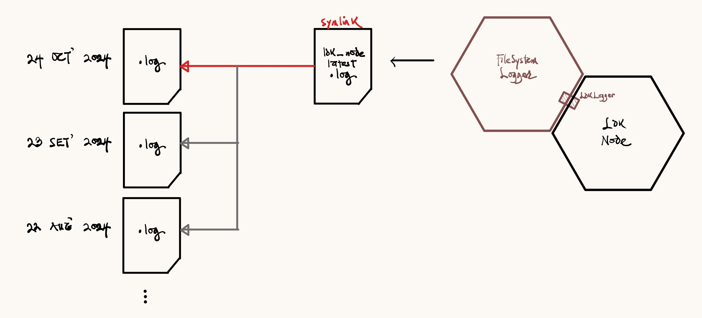
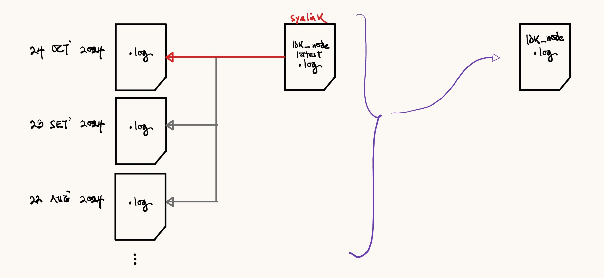
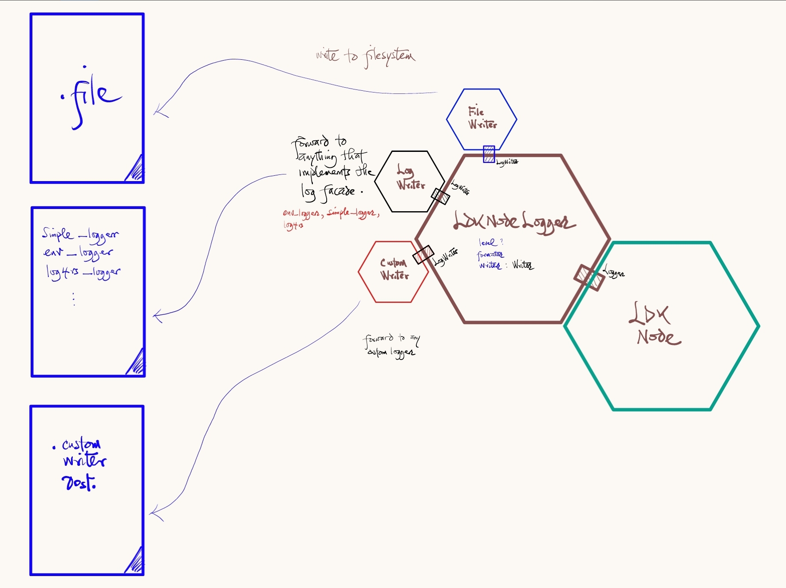
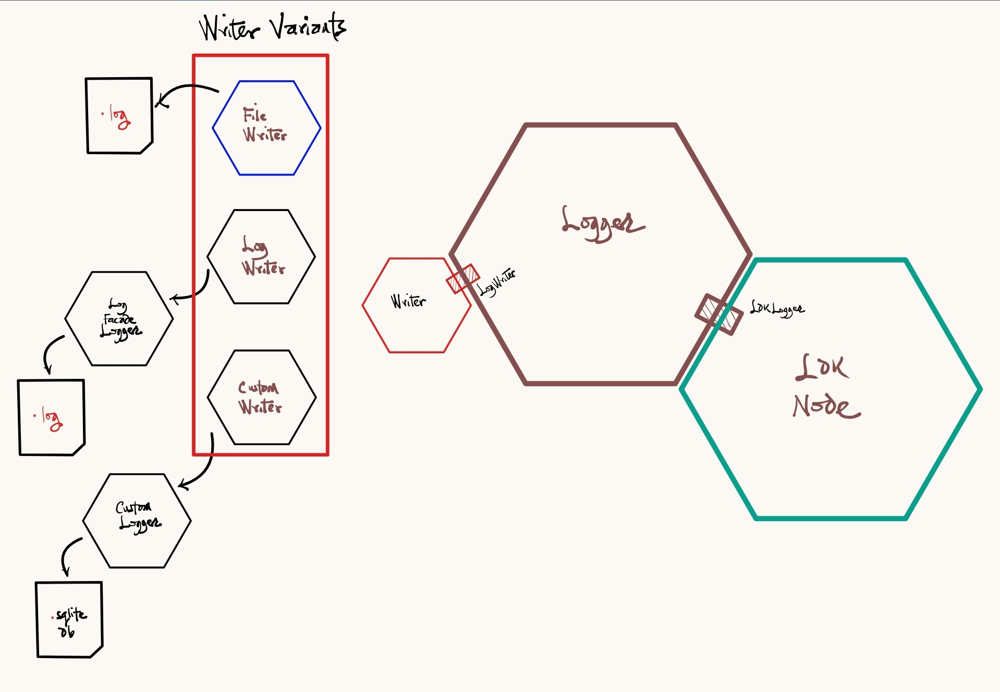

 ## Custom Logging on LDK Node
 I recently started working on exposing a custom logging interface on LDK Node.
 
 This is what I have learned about how logs are currently managed and the improvements I'll be introducing to the ecosystem.

 ### Motivation
 - LDK Node currently uses a `FilesystemLogger` that logs to `ldk_node_latest.log` file.
 - Logging to file might be restrictive for some users who may want to log to destinations other than a file, for example, a database server.
 - The `FilesystemLogger` implements `rust-lightning`'s `Logger`, similar to and modified from `log`'s Log but pruned. Given that log is the defactor log facade used in the Rust ecosystem, users are more likely to have used and prefer this logging facade than rust-lightning's.
 - Additionally, the way log rotation is implemented does not lend nicely to integration with OS-level tools like `logrotate`. 

 ### FilesystemLogger and Log Rotation
 - Log rotation is managed by a symlink (`ldk_node_latest.log`) pointing to new date-encoded (e.g. `2024_11_10_ldk_node.log`) log files created every time the node is started.
 - This rotation style does not dance well with `logrotate` because of the added administration of log file management that's required.

 - To simplify this, we remove the current rotation, replacing with a single `ldk_node.log` file. This reverts the logging functionality to its pre-rotation state.
 - With a single log file, we can pass just this file to `logrotate` for example, without an extra overhead in complexity.

 ### `LogWriter` Interface
 - We create a new logger for LDK Node that implements the upstream `Logger` trait, just as `FilesystemLogger` did. 
 - Initial design saw the adaptation of the FilesystemLogger to write to file (as it already does), and additional `LogRelayWriter` and `CustomWriter` to forward logs to different loggers. 
 - For LogRelayWriter, we wanted users familiar with `log` to use an implementer of the facade. Whatever eventual destination this logger writes to is fully in the control of the user. As an example, a user could forward logs to `simple_logger`, which then writes to the console, or to `log4rs`, which could write to a file, or to the console.
 - For `CustomWriter`, we allow even more flexibility by allowing users provide their own custom loggers. So long as it implements `LogWriter`, we can relay logs to the custom logger which can then write to its destination of choice (e.g. database server).

- To condense the design, we create a logger that wraps a `Writer`, i.e. a type that implements `LogWriter` that can be adapted to different destinations.
- `Writer` is an enumerated type with the following variants: `File`, `Log`, `Custom`. These variants address the primary use cases we hope to address with these changes.

 ### Optional `log` on Upstream `rust-ligtning`
