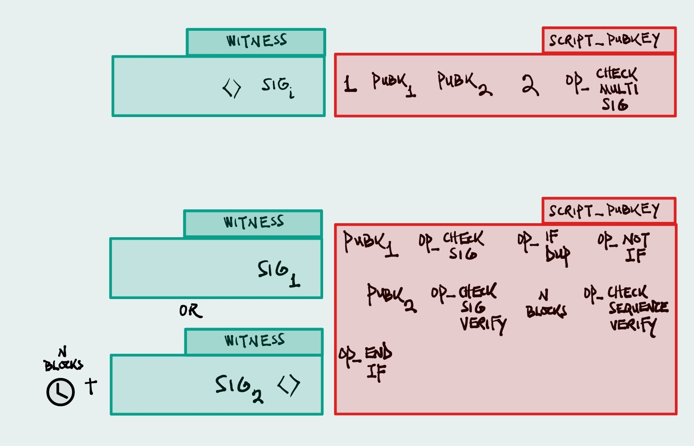
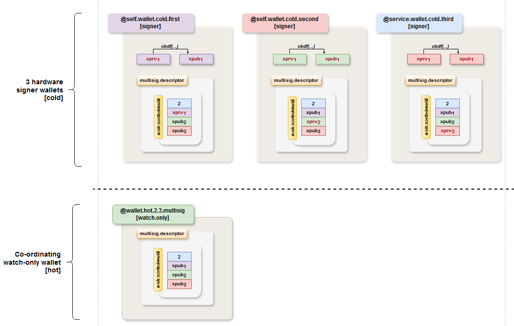
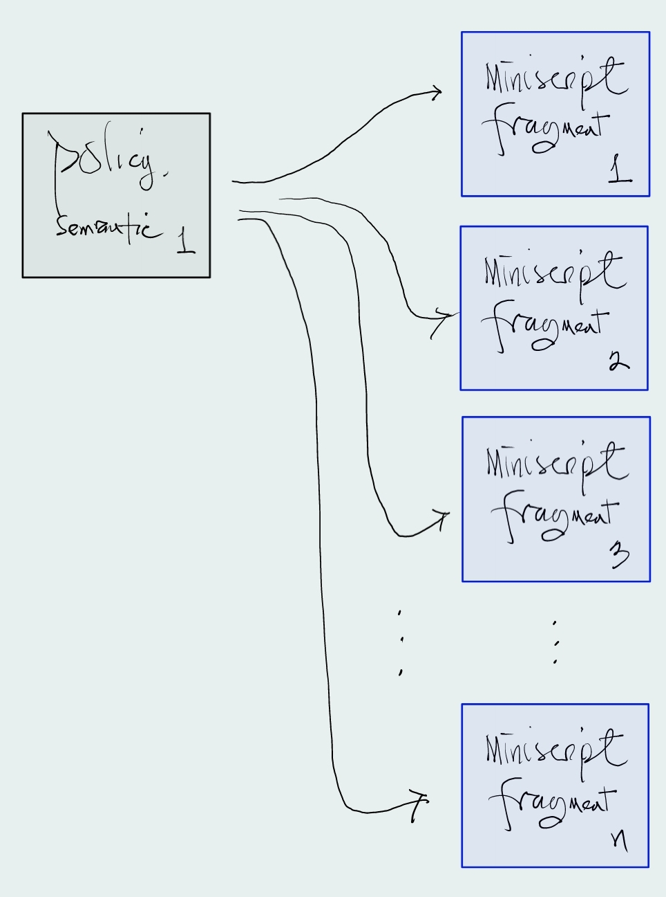
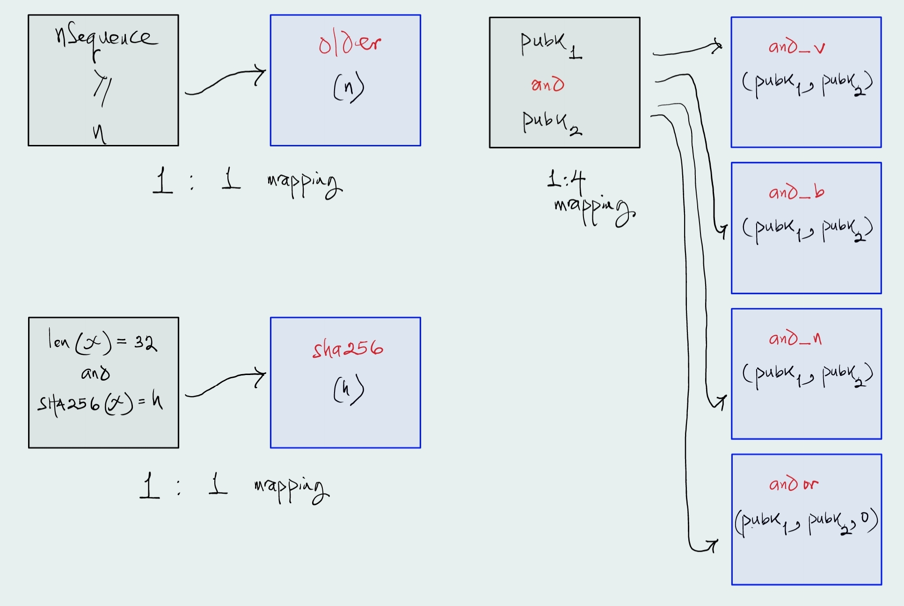
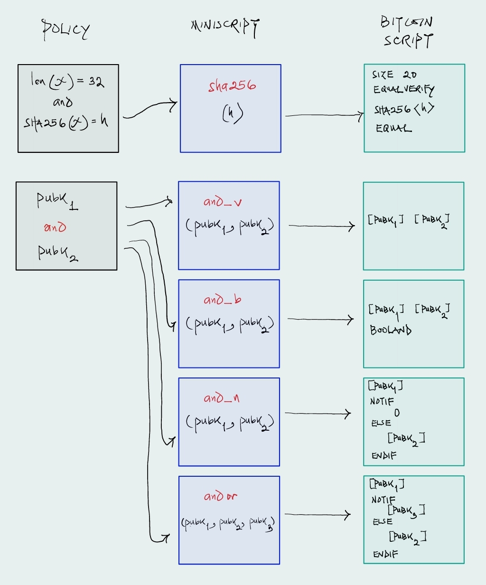

## Miniscript Workshop Presentation
When we create transactions, we encode spending conditions in the transaction outputs.
These conditions stipulate what must be provided to spend the transaction output. Example 
spending conditions include:
- Single signature corresponding to the public key or public key hash encoded in the output.
- `2-of-3` multisignature script where `pubk`1 must sign.
- `1-of-2` multisignature script where either `pubk`1 or `pubk`2 can spend.
- `1-of2` multisignature inheritance script where either `pubk`1 (parent) can spend at any time or `pubk`2 (child) can only spend after `n` (say 4 years) blocks.
- `3-of-3` multisignature script that turns into a `2-of-3` after 30 days.
- Pre-image corresponding to a payment hash for a HTLC.

### Challenges 
Some of these conditions are simple to create and validate for soundness and correctness, however, others prove to be quite tedious because `Script` - the language used in Bitcoin
to encode these conditions, does not lend well to:
- **Composition**: It is difficult to compose scripts. For example, a 1-of-2 multisig (top) script looks markedly different from a 1-of-2 timelocked-inheritance multisig script (bottom). Limitations in `OP_CHECKMULTISIG`, i.e. it's impossible to check timelocks, makes composition difficult such that the eventual script looks nothing like a multisig.

- **Ease of Use**: It is not exactly easy to use. A lot of time is spent ensuring that scripts are arranged in correct order. Take for example, a 2-of-3 multisig with 3 participating hardware wallets. The
descriptor for these wallets have to be constructed carefully so that
any two of the three wallets can spend from addresses/scripts generated
by the co-ordinating wallet. Any modification to the spending condition
will result in another tedious verification exercise.

- **Wallet Interoperability/Importability**: Wallets that do not understand the constructed script cannot import and support it.

- **Spending**: Constructing the right witness to spend is also difficult. Signatures have to be provided in certain order.
- **Optionality**: There is no standard way to write scripts for a given spending condition. You could construct multiple scripts for the same spending condition, optimizing for different properties like compactness and readability, transaction size.
- **Resource Limitations**

### Miniscript: Policy + Miniscript
Programming anything but simple scripts is fraught with challenges, as mentioned previously. To address these challenges and enable advanced spending coditions, Miniscript was created and:
- Provides a policy language that is a simple expressive language that humans can use to codify spending conditions.
- Provides miniscript, a language for writing a sub-set of bitcoin script, enhanced with batteries that facilitate script composition, ease, verify correctness, etc.

Miniscript is bitcoin script representation that makes it easier to write complex scripts, allowing composition, and static analysis.

#### Policy Language
The policy language is succinct. It has seven (7) policies that are sufficient to embed meaning and capture
most use cases. It is easy to use, to read and understand. A few examples below.

| Spending condition | Policy Language |
| :------------------ | :--------------- |
|`2-of-3` multisig, any pair | `thresh`(2, `pk`(key1), `pk`(key2), `pk`(key3))|
| `2-of-3` multisig,`pubk`1 must sign|  `thresh`(2, `pk`(key1), `or`(`pk`(key2), `pk`(key3)))|
|`1-of-2` multisig, `pubk`1 or `pubk`2 can sign| `thresh`(1, `or`(`pk`(key1), `pk`(key2)))|
|`1-of2` mutlisig inheritance, `pubk`1 can spend at any time or `pubk`2 can only spend after `n` blocks/secs| `thresh`(1, `or`(`pk`(key1), `and`(`pk`(key2), `older`(`n`)))) |
|`3-of-3` multisig, turns to `2-of-3` after 30 days| `thresh`(3, `pk`(key1), `pk`(key2), `pk`(key3), `older`(4320))|

#### Policy Compilation to Miniscript
Based on the semantics (meaning) captured by the policy language, policies can be compiled into miniscript,
mapping nicely into a `1:n`policy-to-miniscript-fragment mapping. 

The images below capture examples of `1:n` mappings where `n = 1`, and `n = 4`.

#### Mapping Miniscript to Bitcoin Script
Miniscript is composed of fragments (parts of the language) that map `1:1` to bitcoin scripts. These fragments of two types:
- Normal fragments: taking the form of **`fragment(arguments,...)`**, e.g. **`and_v(x, y)`**.
- Wrapper fragments: taking the form of **`prefix:fragment(arguments,...)`**. The prefixes do not change the meaning of the sub-expressions they wrap. Wrappers can also wrap wrapped sub-expressions, i.e. **`prefix1:prefix2:fragment(arguments,...)`**. Miniscripts in this form are simplified to **`prefix1prefix2:fragment(arguments,...)`**, e.g. **`d:v:older(15)`** == **`dv:older(15)`**

### Resources  
- [Miniscript Documentation](https://bitcoin.sipa.be/miniscript/)  
- [Rust Documentation](https://doc.rust-lang.org/) 